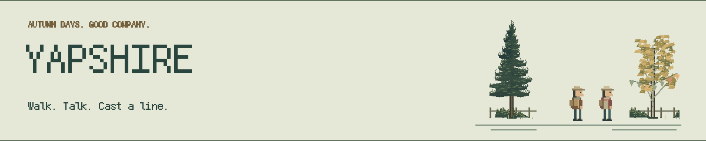
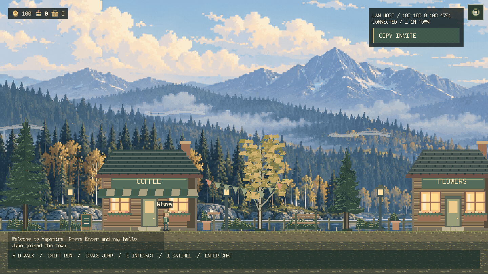
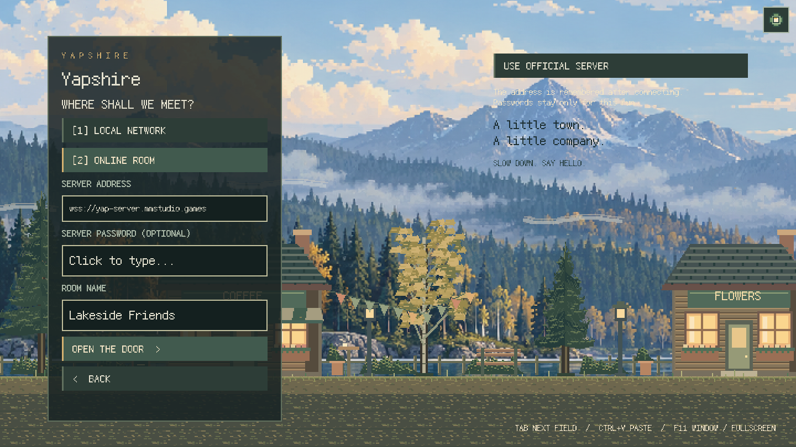
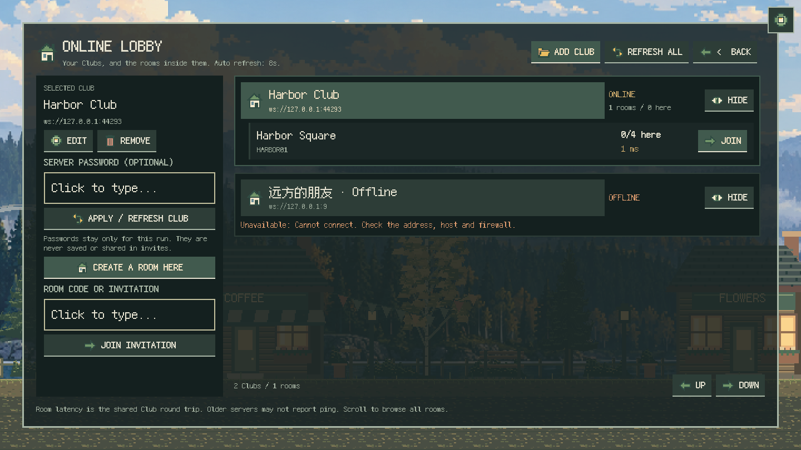

<p align="center">
  <picture>
    <source media="(prefers-color-scheme: dark)" srcset="docs/readme/banner-dark.svg">
    
  </picture>
</p>

<h1 align="center">Yapshire</h1>

<p align="center"><strong>English</strong> · <a href="README.zh-CN.md">简体中文</a></p>

<p align="center">
  <strong>A little town. A little company.</strong><br>
  Meet your friends, chat along a pixel street, and spend an afternoon fishing.
</p>

<p align="center">
  <a href="https://github.com/HsiangNianian/Yapshire/releases/latest"></a>
  <a href="https://github.com/HsiangNianian/Yapshire/actions/workflows/ci.yml"></a>
  <a href="https://github.com/HsiangNianian/Yapshire/releases"></a>
  <a href="LICENSE.md"></a>
</p>

<p align="center">
  <a href="#download-and-play">Download</a> ·
  <a href="#meet-me-in-town">Play together</a> ·
  <a href="#an-afternoon-of-fishing">Fishing</a> ·
  <a href="#controls">Controls</a> ·
  <a href="docs/DEVELOPMENT.md">Development</a> ·
  <a href="CHANGELOG.md">Changelog</a>
</p>

---

## A quiet street, a few good friends

**Yapshire** is a small native multiplayer game built with **Rust and Bevy**.
Walk past the coffee shop, stop for a chat, or buy some tackle and fish at the pier.
Slender pixel characters, misty autumn mountains, warm windows, and speech bubbles
make a place to spend a little time together.

<p align="center">
  
</p>

<p align="center"><sub>Recorded in the game with two connected clients. English interface; 720 × 405 pixel canvas and bundled font.</sub></p>

## Download and play

**[Get the latest release](https://github.com/HsiangNianian/Yapshire/releases/latest)** —
download a game archive, extract it, and launch. Rust, Node.js, and a Cloudflare
account are not needed to play.

| Platform | Download v0.7.2 | After extracting |
| --- | --- | --- |
| Windows · x64 | [Download ZIP](https://github.com/HsiangNianian/Yapshire/releases/download/v0.7.2/yapshire-0.7.2-windows-x64.zip) | Open `yapshire.exe` |
| Linux · x64 | [Download tar.gz](https://github.com/HsiangNianian/Yapshire/releases/download/v0.7.2/yapshire-0.7.2-linux-x64.tar.gz) | Run `./yapshire` |
| macOS · Apple Silicon | [Download tar.gz](https://github.com/HsiangNianian/Yapshire/releases/download/v0.7.2/yapshire-0.7.2-macos-arm64.tar.gz) | Open `Yapshire.app` |
| macOS · Intel | [Download tar.gz](https://github.com/HsiangNianian/Yapshire/releases/download/v0.7.2/yapshire-0.7.2-macos-x64.tar.gz) | Open `Yapshire.app` |

Extract the **whole archive**. On Windows and Linux, keep `assets/` beside the
executable; on macOS, the assets are inside the app. The bundled pixel font supports
English and Simplified Chinese. Every release also includes `SHA256SUMS` and
`CHANGELOG.md`, with matching Release Notes.

Use **v0.7.x** clients and servers with matching content packs (protocol 3).
The official online service uses the same versioned content pack. See [self-hosting](docs/SELF_HOSTING.md) for compatibility and setup.

<details>
<summary><strong>Platform notes</strong></summary>

- **Linux:** builds target Ubuntu 22.04 or newer, with OpenSSL 3 and the usual
  X11/Wayland desktop libraries. A graphics driver supported by Bevy is required.
- **Windows / macOS:** builds are currently unsigned; macOS builds are not
  notarized. Your operating system may ask you to approve opening the app.
- Native GPU play and fullscreen switching have been checked on Linux.
  CI builds and runs code tests on all four targets; Windows/macOS GUI play and
  LAN sessions between two physical computers still need manual verification.

</details>

## Meet me in town

1. **Create a room.** Enter a nickname and choose **Local network** or **Online
   room**. Enter a **room name** and keep the public server or choose your own.
   Use **Copy invite** to share the LAN address or a complete online invitation.
2. **Join LAN.** Rooms on the same network appear automatically. Click one to
   join, or enter an address and port yourself.
3. **Online lobby.** Choose **Add Club**, enter a server address and an optional
   personal alias, and its rooms appear automatically. Save multiple Clubs, edit
   their names or addresses, or remove them from your list. Select a Club to
   create a room there, join a listed room, or paste a complete invitation.

A **Club** is a saved server subscription with your own alias. Its **server**
hosts one or more **rooms**; the **online lobby** groups rooms by Club.
Creating a room uses the selected server. Running your own server is a separate
operator task. Online invitations include the server address and room code, never
the password; pasting one shows its destination before joining. Eight-character
codes still work on the currently selected server.

The official server is **Yapshire Town (Yapshire 小镇)** at
`wss://yap-server.mmstudio.games`, also available at
`wss://yap.meaninglessmeaning.studio`. Both addresses share the same rooms and
players. Its `NIANNIAN` room is always listed, and players can create temporary
rooms. The previous official addresses remain available for existing clients;
updated clients migrate saved official addresses to the new default. Use
**v0.7.x** clients; earlier versions use a different map protocol.

While the online lobby is open, Clubs refresh independently every eight seconds
and show room names, player counts/capacity and measured latency. Room latency
is the shared Club WebSocket round trip; old servers show unknown latency or
capacity instead of estimates. A failed Club does not block the other listings.
Passwords stay in memory for the current run, separately for each Club. Rooms
hold up to **16 players**, with lower limits configurable by the server owner. Press **Enter** to chat; messages appear above your character
and in the recent chat log. Movement pauses while you type.

<details>
<summary><strong>A look at hosting and the lobby</strong></summary>

<p align="center">
  
</p>
<p align="center">
  
</p>

</details>

Public-service and LAN rooms have no accounts or passwords. Dedicated servers
can require a shared password. LAN discovery needs the same
broadcast network; use a manual address when discovery is blocked. See the
[networking guide](docs/DEVELOPMENT.md#networking)
for room lifetimes, ports, proxies, and connection limits.

## Run your own server

**New in v0.5:** download a **yapshire-server** archive from
[Releases](https://github.com/HsiangNianian/Yapshire/releases/latest), extract it,
and run `./yapshire-server` (`./yapshire-server.exe` on Windows). No GPU or game
window is required. Join `ws://127.0.0.1:4761` and choose **MAIN0001**.

```sh
docker run -d --name yapshire --restart unless-stopped \
  -p 4761:4761 ghcr.io/hsiangnianian/yapshire-server:v0.7.2
```

The Linux AMD64/ARM64 image and four native server downloads use the same
`.tmj` files as the in-game editor. The server sends its maps to joining players;
their own saved maps are restored on leaving. Follow the
[self-hosting guide](docs/SELF_HOSTING.md) for custom maps, passwords, Docker
Compose, configuration and public access.

## An afternoon of fishing

**Included in the v0.7.2 downloads above.**

Walk east past the street sign to **Tide & Tackle**. Press **E** at the door to
enter, walk up to Mara's counter, and press **E** again to shop. A new nickname
starts with **100 coins**: a reusable bamboo rod costs **45**, a reusable hook
costs **15**, and five worms cost **10**. Click a purchase or use **1 / 2 / 3**.

Continue east to the seaside pier and press **E** to cast. Each cast uses one
worm. When **BITE!** appears, tap **Space** before the timer runs out. Then hold
**Space** to reel and release it to ease the line tension. Fill the catch meter
without snapping the line or letting the fish escape.

Press **I** to open your illustrated satchel: tackle, bait, coins and fish have
pixel sprites, stack counts and equipped states. The shop uses matching item
cards. At the pier, watch your cast, bobbing float, splashes and swimming fish;
the water view shows the fish coming closer as you reel.

Take your sardines, mackerel, sea bass, or
golden bream back to the counter and choose **Sell catch** (**4**) to earn coins.
Mara supplies one emergency worm if you have tackle but no bait, no fish to sell,
and fewer than 10 coins.

Wallets, tackle, bait, and catches save locally under each nickname. Use the same
nickname to continue; progress does not sync between computers. Friends can see
one another inside the shop and see fishing rods on the pier when using the
updated client and server.

The street floor, coast, pier and tackle shop use 16 × 16 tilemaps, including
animated water. Edit the shipped `.tmj` maps in Tiled and restart the game to see
your layout changes. See the [map editing guide](docs/DEVELOPMENT.md#tilemaps)
for the supported authoring workflow.

## Make the town your own

**New in v0.4.0:** choose **04 MAP EDITOR** on the main menu (or
press **4 / F2** with no text field selected). Edit the town and coast or the
tackle-shop interior without leaving the game. Pick a layer and tile, then paint,
erase, fill or pick an existing tile. Undo/redo, tile flips, layer visibility,
grid guides, zoom and panning are included.
Pixel tool icons have shortcut badges and hover descriptions; eye icons toggle layers.

**Save** applies the layout immediately and keeps a local copy for your next
launch. **Map files** opens the saved `.tmj` files and their Tiled-compatible
tileset. Original bundled maps stay intact; **Original** restores one as an
undoable draft. Leaving with unsaved edits asks whether to save or discard them.
LAN hosting shares your saved maps; dedicated servers distribute their configured
maps. Joining never overwrites your local editor files. Gold guides preview the map's interaction objects.
See the [in-game editor guide](docs/DEVELOPMENT.md#in-game-map-editor).

**Since v0.7.1:** [Content packs v1](docs/CONTENT_PACKS.md)
splits terrain, water, buildings, objects and backgrounds into reusable resources.
It adds stable asset IDs, terrain connections, complete object stamps, variable map
lists and sizes, and map-defined collision/portals/shops/fishing regions. Custom
packs use the same pipeline as official content. This build uses protocol 3;
run a matching protocol 3 server. Earlier releases use protocol 2 and cannot join these rooms.

This release also includes an [autumn lakeside art update](docs/ART_DIRECTION.md):
misty mountains, conifers, gold birches, cedar buildings and a dark forest/brass UI.
It keeps the editable tile grid and bundled fonts in both languages.

## Settings and language

Open the icon-only pixel gear in the **top-right corner** from the
menu, game or map editor. Its tap target stays at least 48 points on small windows. Switch between **English** and **简体中文** immediately;
your choice is remembered after restarting. **SCALE** offers **2x / 3x / 4x**
(default **2x**). Larger pixels bring the world closer; changes apply immediately
and persist after restart, in windowed and fullscreen modes. Missing translations fall back to
English. Translation files are split by feature under `assets/locales/`; see the
[translation guide](docs/TRANSLATING.md) to contribute.

## Controls

| Key | Action |
| --- | --- |
| A / D or Left / Right | Walk |
| Shift | Run |
| Space | Jump / hook a bite / hold to reel |
| E | Enter or leave the tackle shop, browse the counter, cast at the pier |
| I | Open / close your satchel |
| Enter | Open chat / send |
| Escape | Close the current panel or cancel a cast, leave the shop, close chat, or leave the room |
| Tab | Next input field |
| Ctrl+A / Ctrl+V / Ctrl+C | Select, paste, or copy in an input |
| F11 | Switch between the fixed window and fullscreen |
| F12 | Save a screenshot under `artifacts/` |

Windowed mode stays at **1440 × 810**. Fullscreen keeps the scene and interface
at the same scale, with centered borders when needed to preserve crisp pixels.

## Build from source

Install **Rust stable**. Windows also needs the MSVC C++ build tools; macOS needs
Xcode Command Line Tools.

<details>
<summary><strong>Linux build dependencies (Ubuntu)</strong></summary>

```sh
sudo apt-get install build-essential pkg-config libssl-dev libx11-dev libxrandr-dev libxi-dev libxcursor-dev libxkbcommon-dev libwayland-dev libudev-dev
```

</details>

```sh
git clone https://github.com/HsiangNianian/Yapshire.git
cd Yapshire
cargo run --locked
```

The first build compiles Bevy and can take a while. Checked-in artwork and fonts
are ready to use. No server setup is needed for the built-in online service or
for hosting a LAN room.

## Made with pixels

- **Rust · Bevy 0.18.1 · bevy_ecs_tilemap** — a 720 × 405 world, integer pixel
  scaling, original sprites and tiles, and layered scenery.
- **Fusion Pixel Font** — a bundled bitmap-style font for menus, chat, and
  speech bubbles.
- **WebSockets · Cloudflare Containers** — the same Rust server handles local,
  self-hosted and official online rooms; a Worker and Durable Object route
  connections to the official server container.

The headless server lives in `crates/yapshire-server`, with shared map and protocol
types in `crates/yapshire-shared`. Cloudflare deployment and the old-address
gateway live in `server/`; see [deployment setup](docs/DEVELOPMENT.md#cloudflare-server).

## Development and contributions

Bug reports, gameplay improvements, pixel art, and documentation are welcome.
For connection issues, include the platform, LAN or online mode, and steps to
reproduce. See [CONTRIBUTING.md](CONTRIBUTING.md).

Install the [pre-commit hooks](CONTRIBUTING.md#pre-commit-checks) once per checkout,
then run:

```sh
pre-commit run --all-files
cargo fmt --all -- --check
cargo test --workspace --locked
node --test .github/scripts/*.test.mjs
python3 -m unittest discover -s tools -p 'test_*.py'
```

CI tests and packages game and server on all four platforms, plus the Docker image.
Version tags publish the same builds
to GitHub Releases after checks pass, then update the changelog from the same
Conventional Commits used for Release Notes.

| Looking for | Start here |
| --- | --- |
| Local development, networking, or your own server | [Development guide](docs/DEVELOPMENT.md) |
| Real game, movement, chat, and display checks | [GPU acceptance](docs/DEVELOPMENT.md#gpu-acceptance-and-artwork) |
| Build matrix and release automation | [CI](docs/DEVELOPMENT.md#cross-platform-ci) · [Releasing](docs/DEVELOPMENT.md#releases-and-changelog) |
| Report a bug or propose a change | [Issues](https://github.com/HsiangNianian/Yapshire/issues) · [Contributing](CONTRIBUTING.md) |
| What changed | [Changelog](CHANGELOG.md) · [Releases](https://github.com/HsiangNianian/Yapshire/releases) |

## License

Code and original artwork are licensed under **AGPL-3.0-only**; see
[LICENSE.md](LICENSE.md). [Fusion Pixel Font](https://github.com/TakWolf/fusion-pixel-font)
retains its own license and upstream notices in [`assets/fonts/`](assets/fonts/).

<p align="center"><sub>SLOW DOWN. SAY HELLO.</sub></p>
