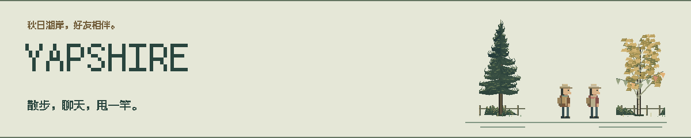
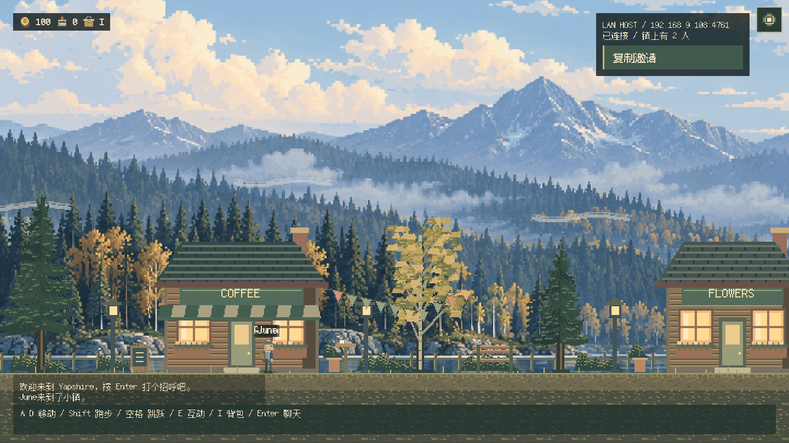
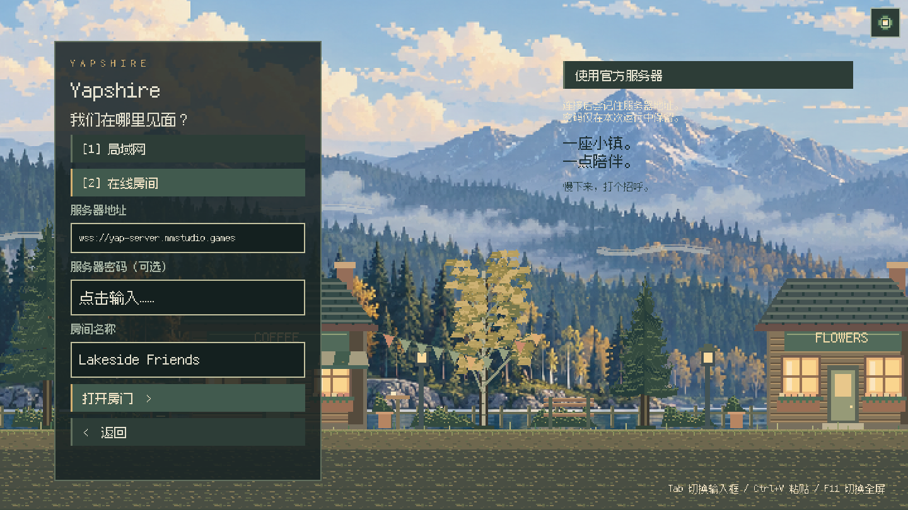
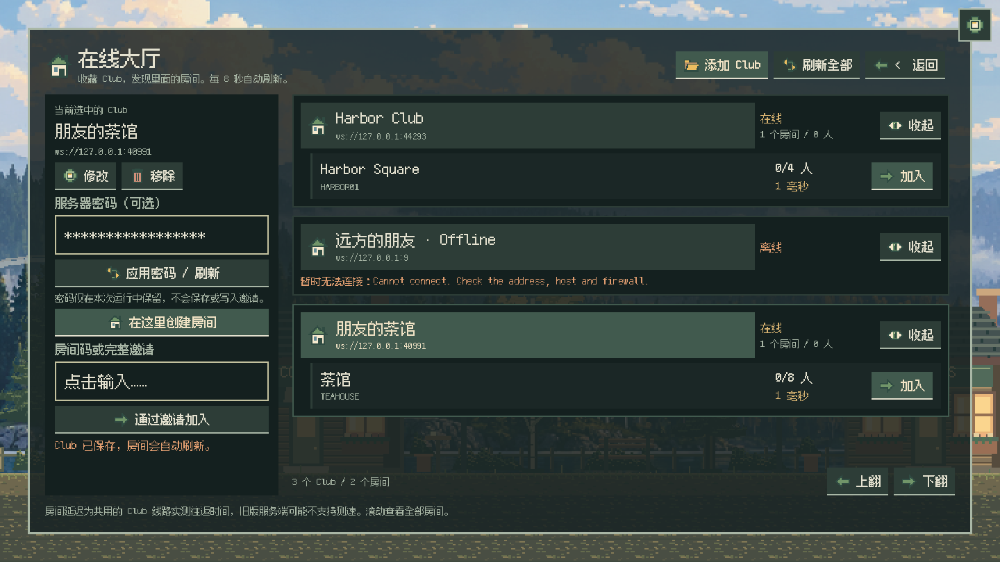

<p align="center">
  <picture>
    <source media="(prefers-color-scheme: dark)" srcset="docs/readme/banner-dark-zh.svg">
    
  </picture>
</p>

<h1 align="center">Yapshire</h1>

<p align="center"><a href="README.md">English</a> · <strong>简体中文</strong></p>

<p align="center">
  <strong>小小的镇，刚好的陪伴。</strong><br>
  找到朋友，沿着像素街道聊聊天，再到海边钓一下午鱼。
</p>

<p align="center">
  <a href="https://github.com/HsiangNianian/Yapshire/releases/latest"></a>
  <a href="https://github.com/HsiangNianian/Yapshire/actions/workflows/ci.yml"></a>
  <a href="https://github.com/HsiangNianian/Yapshire/releases"></a>
  <a href="LICENSE.md"></a>
</p>

<p align="center">
  <a href="#下载即玩">下载</a> ·
  <a href="#在小镇碰面">一起玩</a> ·
  <a href="#去海边钓一会儿">钓鱼</a> ·
  <a href="#操作方式">操作</a> ·
  <a href="docs/DEVELOPMENT.md">开发指南</a> ·
  <a href="CHANGELOG.md">更新日志</a>
</p>

---

## 一条安静的街，几个聊得来的朋友

**Yapshire** 是用 **Rust 和 Bevy** 制作的原生多人像素小游戏。
经过咖啡馆，停下来聊会儿天，或者买好渔具，到码头钓鱼。
修长的像素小人、雾中的秋日山林、暖色窗灯和聊天气泡，组成一个可以一起待着的小地方。

<p align="center">
  
</p>

<p align="center"><sub>两个真实客户端联机录制，使用游戏内中文界面和随包提供的像素字体。</sub></p>

## 下载即玩

**[下载最新版本](https://github.com/HsiangNianian/Yapshire/releases/latest)**，完整解压后启动。
游玩不需要安装 Rust、Node.js，也不需要 Cloudflare 账号。

| 平台 | 下载 v0.7.2 | 解压后启动 |
| --- | --- | --- |
| Windows · x64 | [下载 ZIP](https://github.com/HsiangNianian/Yapshire/releases/download/v0.7.2/yapshire-0.7.2-windows-x64.zip) | 打开 `yapshire.exe` |
| Linux · x64 | [下载 tar.gz](https://github.com/HsiangNianian/Yapshire/releases/download/v0.7.2/yapshire-0.7.2-linux-x64.tar.gz) | 运行 `./yapshire` |
| macOS · Apple Silicon | [下载 tar.gz](https://github.com/HsiangNianian/Yapshire/releases/download/v0.7.2/yapshire-0.7.2-macos-arm64.tar.gz) | 打开 `Yapshire.app` |
| macOS · Intel | [下载 tar.gz](https://github.com/HsiangNianian/Yapshire/releases/download/v0.7.2/yapshire-0.7.2-macos-x64.tar.gz) | 打开 `Yapshire.app` |

请解压**整个压缩包**。Windows 和 Linux 需要将 `assets/` 与程序放在一起；
macOS 的资源已经放在应用内部。像素字体随包提供，包含中英文字形。
每次发布同时提供 `SHA256SUMS` 校验文件和 `CHANGELOG.md`，更新日志与 Release Notes 同步。

客户端与服务端需要使用 **v0.7.x**（协议 3）及匹配的内容包，公共服务使用同一套版本化内容包。旧版客户端需要先更新。详见[开服指南](docs/SELF_HOSTING.zh-CN.md)。

<details>
<summary><strong>各平台说明</strong></summary>

- **Linux：**构建环境为 Ubuntu 22.04，需要 OpenSSL 3、常见的 X11/Wayland 桌面库，以及 Bevy 支持的显卡驱动。
- **Windows / macOS：**目前未做代码签名，macOS 也未公证；系统可能要求确认后才能打开应用。
- 已在 Linux 原生 GPU 环境验证游玩和全屏切换。CI 构建并测试四个平台；Windows/macOS 图形界面和两台实体电脑之间的局域网联机仍待人工验证。

</details>

## 在小镇碰面

1. **创建房间（Create a room）。** 输入昵称，选择局域网（Local network）或在线房间（Online room）。在线建房填写**房间名**，可以使用内置公共服务器或自己的服务器。用 **复制邀请** 分享局域网地址或完整在线邀请。
2. **局域网联机（Join LAN）。** 自动寻找同一网络里的房间，点选即可加入，也可以手动填写地址和端口。
3. **在线大厅（Online lobby）。** 点击**添加 Club**，填写服务器地址和可选别名，自动展示它的所有房间。可以收藏多个 Club、修改别名或地址、从自己的列表移除。选中 Club 后，可在其中创建房间、加入已有房间，或粘贴完整邀请。

**Club** 是保存到本机的服务器订阅，可以起自己的别名。**服务器**承载一个或多个**房间**，
**在线大厅**按 Club 分组展示房间。
创建房间使用已有服务器；搭建服务器是服主独立部署服务的操作。
在线邀请包含服务器地址和房间码，不含密码。粘贴后先显示目标地址，再点击加入；
单独输入八位房间码仍会使用当前选定的服务器。

官方服务器为 **Yapshire 小镇**，默认地址为 `wss://yap-server.mmstudio.games`，
也可以使用 `wss://yap.meaninglessmeaning.studio`。两个地址共用房间和玩家列表。
`NIANNIAN` 是常驻房间，玩家也可以创建临时房间。旧官方地址继续兼容已有客户端；
更新后的客户端会把已保存的旧官方地址迁移到新默认地址。
请使用 **v0.7.x 客户端**，以匹配公共服务器的协议 3 和版本化内容包。

在线大厅打开时，各 Club 每八秒独立刷新，显示房间人数／容量与实测延迟。
延迟是同一 Club 共用的 WebSocket 往返时间；旧服务端不支持的延迟或容量显示为未知，
一个 Club 离线不会阻止其他列表刷新。各 Club 的密码分别保留在本次运行的内存里。
每个房间最多 **16 人**，服主可以设置更低的上限。
按 **Enter** 聊天，消息同时显示在角色头顶和最近聊天记录中；输入时角色停止移动。

<details>
<summary><strong>看看开房和大厅</strong></summary>

<p align="center">
  
</p>
<p align="center">
  
</p>

</details>

公共服务和局域网房间没有账号或密码，独立服务端可以设置共用密码。
局域网自动发现需要处于同一广播网络；发现被阻止时可手动输入地址。
官方小镇提供一个常驻房间和一个临时房间。房间生命周期、端口、代理和连接限制见[联网说明](docs/DEVELOPMENT.md#networking)。

## 开自己的服务端

**v0.5 新增：**在 [Releases](https://github.com/HsiangNianian/Yapshire/releases/latest)
下载 **yapshire-server** 压缩包，解压后运行 `./yapshire-server`，Windows 使用
`./yapshire-server.exe`。无需显卡或游戏窗口，在客户端连接 `ws://127.0.0.1:4761`，
选择 **MAIN0001** 即可进入。

```sh
docker run -d --name yapshire --restart unless-stopped \
  -p 4761:4761 ghcr.io/hsiangnianian/yapshire-server:v0.7.2
```

提供 Linux AMD64/ARM64 镜像，以及四个平台的原生服务端下载。
服务端与游戏内编辑器共用 `.tmj` 地图，玩家加入时自动接收服务端地图，离开后恢复自己的本地地图。
自定义地图、密码、Docker Compose、配置与公网连接方式见[中文开服指南](docs/SELF_HOSTING.zh-CN.md)。

## 去海边钓一会儿

**上方 v0.7.2 下载包已包含钓鱼、渔具店与像素背包。**

沿街向右走，跟着路牌找到 **Tide & Tackle** 渔具店。在门口按 **E** 进入，
走到 Mara 的柜台前再按 **E** 购物。新昵称拥有 **100 枚金币**：
可重复使用的竹鱼竿 **45 枚**、鱼钩 **15 枚**、五条鱼饵 **10 枚**。
点击商品或按 **1 / 2 / 3** 购买。

继续向右走到滨海码头，按 **E** 抛竿，每次消耗一条鱼饵。
出现 **BITE!** 时，在倒计时结束前按一下 **Space** 提竿；
随后按住 **Space** 收线，松开降低张力。在鱼逃走或鱼线绷断前填满收获进度。

按 **I** 打开像素背包，查看渔具、鱼饵、金币和鱼的图标、数量与装备状态；
商店也会展示对应的像素商品。钓鱼时能看到抛线、浮漂、水花和游鱼，
水下小视窗会随着收线显示鱼逐渐靠近。

钓到的沙丁鱼、鲭鱼、海鲈和金鲷可以带回柜台，
选择 **Sell catch** 或按 **4** 出售。已经拥有鱼竿和鱼钩，
却没有鱼饵、没有可卖的鱼且金币不足 10 枚时，店主会赠送一条应急鱼饵。

钱包、渔具、鱼饵和收获按昵称自动保存在本机，使用相同昵称即可继续，
不同电脑之间不共享存档。使用更新后的客户端和服务器时，可以在店里看到朋友，
也可以看到其他玩家在码头垂钓。

街道路面、海岸、码头和渔具店使用 **16 × 16 Tilemap**，海水采用动画图块。
可以用 Tiled 打开随附的 `.tmj` 地图，修改后重启游戏即可查看布局。
当前源码的碰撞和交互由地图定义，具体规范见[内容包说明](docs/CONTENT_PACKS.zh-CN.md)。

## 编辑自己的小镇

**v0.4.0 新增：**在主菜单选择 **04 MAP EDITOR / 地图编辑器**，或在没有选中输入框时按 **4 / F2**，
即可编辑小镇海岸与渔具店内景。选择图层和图块后，用画笔、橡皮、填充或取色工具修改地图，
支持撤销重做、图块翻转、图层显隐、网格、缩放和平移。
工具栏采用像素图标，带快捷键角标与悬停说明；点击眼睛图标切换图层显隐。

点击 **Save** 后立即应用，重启也会加载本机保存的地图；**Map files** 打开保存目录，
其中的 `.tmj` 与图块集可继续在 Tiled 中编辑。原始资源保持不变，**Original** 可将原地图
恢复为一份可撤销的草稿，退出时会提示保存或丢弃未保存的修改。
局域网房主会共享自己保存的地图，独立服务端会下发配置的地图；加入房间不会覆盖本地编辑器文件。
金色辅助标记直接显示地图定义的交互对象。
详细操作见[游戏内编辑器指南](docs/DEVELOPMENT.md#in-game-map-editor)。

**v0.7.1 引入：**[内容包规范 v1](docs/CONTENT_PACKS.zh-CN.md) 将地形、水体、建筑、物件和背景拆为独立资源，
提供稳定 ID、自动连接地形、完整物件印章、多地图与可变尺寸，以及地图定义的碰撞、传送门、商店和钓鱼区域。
社区内容包与官方资源共用加载流程。此版本使用协议 3，需要匹配的协议 3 服务端；旧版协议 2 无法加入新版房间。

本版还加入了[秋日湖岸美术更新](docs/ART_DIRECTION.zh-CN.md)：雾蓝远山、针叶林、金色白桦、
雪松木屋与深森林色配黄铜色界面，继续支持可编辑 tilemap 和内置中英文字体。

## 设置与语言

主菜单、游戏和地图编辑器**右上角常驻纯像素齿轮**，小窗口下保留至少 48 点的点击区域。
点击后可以
即时切换 **English / 简体中文**，重启后会记住选择。**像素缩放（SCALE）**可选
**2x / 3x / 4x**，默认 **2x**；倍率越大，人物和地形越大、视野越近。
切换立即生效，重启后保留，支持窗口和全屏。缺失的翻译默认显示英文。
文案按功能拆分在 `assets/locales/` 下，翻译方式见[翻译指南](docs/TRANSLATING.md)。

## 操作方式

| 按键 | 功能 |
| --- | --- |
| A / D 或方向键 ← / → | 走动 |
| Shift | 跑步 |
| Space | 跳跃 / 咬钩时提竿 / 按住收线 |
| E | 进出渔具店、在柜台购物、在码头抛竿 |
| I | 打开 / 关闭像素背包 |
| Enter | 打开聊天 / 发送消息 |
| Escape | 关闭当前面板或取消抛竿、离开商店、关闭聊天或离开房间 |
| Tab | 切换输入框 |
| Ctrl+A / Ctrl+V / Ctrl+C | 输入框内全选、粘贴或复制 |
| F11 | 固定窗口 / 全屏切换 |
| F12 | 截图保存到 `artifacts/` |

窗口模式固定为 **1440 × 810**。全屏时场景与界面同步缩放，必要时居中留边，保持像素清晰。

## 从源码运行

安装 **Rust stable**。Windows 还需要 MSVC C++ 构建工具；macOS 需要 Xcode Command Line Tools。

<details>
<summary><strong>Linux 构建依赖（Ubuntu）</strong></summary>

```sh
sudo apt-get install build-essential pkg-config libssl-dev libx11-dev libxrandr-dev libxi-dev libxcursor-dev libxkbcommon-dev libwayland-dev libudev-dev
```

</details>

```sh
git clone https://github.com/HsiangNianian/Yapshire.git
cd Yapshire
cargo run --locked
```

首次编译 Bevy 需要一些时间。美术和字体已经包含在仓库中。
使用内置在线服务或自己开局域网房间，都不需要另行部署服务器。

## 用像素搭起来

- **Rust · Bevy 0.18.1 · bevy_ecs_tilemap：**720 × 405 的世界画面，整数倍像素缩放、原创角色与地块、分层场景。
- **Fusion Pixel Font：**随游戏打包的像素字体，用于菜单、聊天和气泡。
- **WebSockets · Cloudflare Containers：**局域网、自建服务器和官方在线服务共用 Rust 服务端；Worker 与 Durable Object 将官方入口的连接转发到服务端容器。

独立服务端代码在 `crates/yapshire-server`，共享地图和协议模块在 `crates/yapshire-shared`。
`server/` 包含 Cloudflare 部署和旧地址兼容入口，见[部署指南](docs/DEVELOPMENT.md#cloudflare-server)。

## 开发与贡献

欢迎提交问题、玩法改进、像素美术和文档修改。报告连接问题时，请附上平台、
局域网或在线模式，以及复现步骤。详见[贡献指南](CONTRIBUTING.md)。

首次使用时先[安装 pre-commit hooks](CONTRIBUTING.md#pre-commit-checks)，然后运行：

```sh
pre-commit run --all-files
cargo fmt --all -- --check
cargo test --workspace --locked
node --test .github/scripts/*.test.mjs
python3 -m unittest discover -s tools -p 'test_*.py'
```

CI 测试并打包四个平台的游戏与服务端，以及 Docker 镜像。版本标签触发正式发布，全部检查通过后上传到 GitHub Releases，
再使用同一份 Conventional Commits 生成 Release Notes 和更新日志。

| 想了解 | 从这里开始 |
| --- | --- |
| 本地开发、联网或自行部署 | [开发指南](docs/DEVELOPMENT.md) |
| 实际游玩、走动、聊天和显示验证 | [GPU 验收](docs/DEVELOPMENT.md#gpu-acceptance-and-artwork) |
| 构建矩阵与发布自动化 | [CI](docs/DEVELOPMENT.md#cross-platform-ci) · [发布流程](docs/DEVELOPMENT.md#releases-and-changelog) |
| 反馈问题或提出改进 | [Issues](https://github.com/HsiangNianian/Yapshire/issues) · [贡献指南](CONTRIBUTING.md) |
| 版本变化 | [更新日志](CHANGELOG.md) · [Releases](https://github.com/HsiangNianian/Yapshire/releases) |

## 许可证

代码和原创美术使用 **AGPL-3.0-only**，详见 [LICENSE.md](LICENSE.md)。
[Fusion Pixel Font](https://github.com/TakWolf/fusion-pixel-font) 保留原有许可证和声明，随附于 [`assets/fonts/`](assets/fonts/)。

<p align="center"><sub>慢下来，打个招呼。</sub></p>
