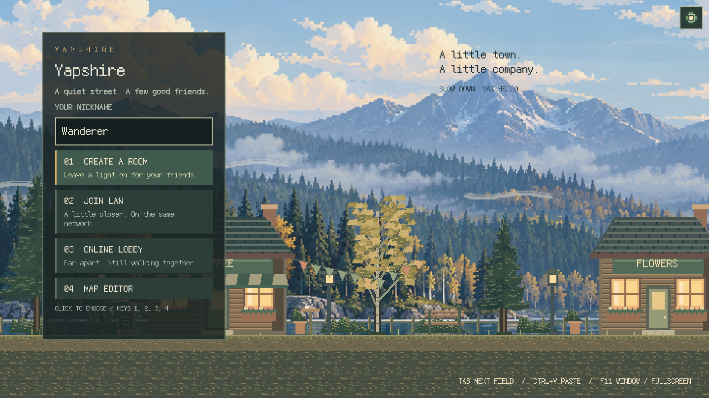

# Autumn lakeside art

[简体中文](ART_DIRECTION.zh-CN.md)

The visual reference is the atmospheric pixel landscape in
[Cast n Chill's official screenshots](https://store.steampowered.com/app/3483740/Cast_n_Chill/).
Yapshire uses its own scenery, characters, tiles and interface: blue mountain
haze, dark conifers, ochre birches, cedar siding, pale window light and quiet
horizontal water reflections. Foreground silhouettes stay darker and sharper
than the distant landscape. The default 2x view uses a 720 × 405 nearest-sampled
world canvas. Settings also offers 3x and 4x for larger pixels and a closer view;
UI uses the bundled pixel font in both languages.

Actual development build (English):



## Editable assets

| Asset | Source | Contract |
| --- | --- | --- |
| `assets/hills.png` | Built-in `image_gen`, prompt below | Opaque 3:1 panorama; 1620 × 540 world pixels, parallax constrained to cover wide maps |
| `assets/town.png`, `people.png`, `sky.png`, `cloud.png`, `shadow.png` | `tools/draw_assets.py` | Transparent foreground and 20 × 32 character cells |
| `assets/packs/yapshire/` | `tools/draw_maps.py` → `tools/build_content.py` | Pack 1.1.0, four 16px tilesets, 375 stable tile IDs, ten prefabs |
| `assets/fishing/` | `tools/draw_fishing.py` | 32px inventory cells, sliced panel borders and underwater view |
| UI colors | `src/ui.rs` | Shared forest surfaces, ivory text, muted sage and brass accents |

The generated panorama is checked into the repository. The game and asset
generators do not require an image service or network access. The panorama has
no text, so English and Chinese use the same art. In-world text and controls
continue to use the existing localization system.

Run the generators in the order documented in [DEVELOPMENT.md](DEVELOPMENT.md).
They preserve `hills.png` and the frozen `assets/maps/` legacy fixtures. Generating
the official pack replaces its supplied layouts; keep authored copies elsewhere.
The art update preserves all tile IDs, atlas cell positions, animation frames,
walking routes and gameplay interaction positions. The decorative lighthouse
moves down to the new lake horizon. Installed pack assets still need
to match the host's pack version and image hashes when playing online.

## Panorama prompt

Tool: built-in `image_gen`. The selected output is the unmodified 2172 × 724 PNG
at `assets/hills.png`; the game handles sizing and nearest sampling.

```text
Use case: stylized-concept. Asset type: an actual in-game scrolling background plate for a side-view pixel-art exploration and fishing game, not a screenshot or concept layout. Generate an original exceptionally beautiful quiet northern lakeshore in early autumn morning. Very wide panoramic composition, ideally 3072 by 768 pixels (4:1). Pixel-art painting with crisp square pixel clusters, hand-placed textured edges, no antialiasing and no smooth photographic rendering. At native game viewing scale it should resemble detailed 16-bit landscape painting: hazy powder-blue distant mountain ridges, several layers of muted blue-grey and slate-green fir forests along the opposite shore, some ochre and faded gold birch patches catching sunlight, pale silver-blue morning fog drifting between layers. Calm deep desaturated blue-green lake occupies the lower 35 percent, with long thin horizontal broken reflections and silver-gold scattered highlights. Sky occupies the top 25 percent: soft pale blue and cream cumulus cloud bands. Beautiful atmospheric perspective and restrained natural colors, deep forest shadows balanced with warm light, tranquil and spacious. A coherent continuous horizon across the full very wide image. No near foreground trees, no foreground land strip, no buildings, no boats, no people, no lettering, no logos, no frame, no interface. The foreground walkable bank, fishing pier, characters and shops will be drawn separately by the game. Entire canvas must be fully painted and opaque. The scene must feel like a real contemplative landscape rather than a vector illustration: irregular organic silhouettes, subtle clustered pixel texture, readable value separation. Do not copy an existing game's composition or assets.
```
