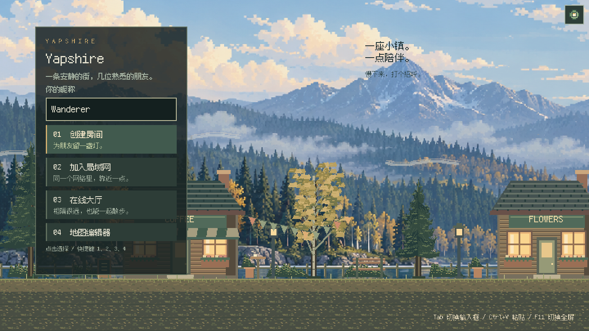

# 秋日湖岸美术

[English](ART_DIRECTION.md)

视觉参考来自 [Cast n Chill 的官方截图](https://store.steampowered.com/app/3483740/Cast_n_Chill/)。
Yapshire 的场景、角色、地砖和界面采用雾蓝色远山、深色针叶林、赭金色白桦、
雪松木墙、暖色窗光与水平水面倒影。近景比远景更深、更清晰，留出环境的空间感。
默认 2x 使用 720 × 405 画布与最近邻采样；设置中也可选择 3x 或 4x，
让像素更大、视野更近。中英文界面共用内置像素字体。

当前开发构建实机截图（简体中文）：

| 资源 | 来源 | 约定 |
| --- | --- | --- |
| `assets/hills.png` | 内置 `image_gen` 生成的原创远景 | 3:1 不透明全景；以 1620 × 540 世界像素显示，水平视差限制在覆盖视口的范围内 |
| 小镇前景、人物、天空、薄云与阴影 | `tools/draw_assets.py` | 前景保持透明，人物动画单元为 20 × 32 |
| `assets/packs/yapshire/` | `tools/draw_maps.py`、`tools/build_content.py` | 内容包 1.1.0；四张 16px 图集、375 个稳定 ID、十个预制图案 |
| `assets/fishing/` | `tools/draw_fishing.py` | 物品图标、可伸缩像素边框和水下视图 |
| 界面配色 | `src/ui.rs` | 深色森林底、象牙白文字、鼠尾草绿和黄铜色强调 |

远景 PNG 已随项目保存，运行游戏或重新生成可编辑素材都不需要图像服务或联网。
远景没有文字，中英文共用；控件文案继续使用现有翻译目录。
完整生成提示词与实际输出尺寸见[英文文档](ART_DIRECTION.md#panorama-prompt)。

请按 [DEVELOPMENT.md](DEVELOPMENT.md) 的顺序生成素材。这些命令不会覆盖远景
`hills.png`，也不会改写用于旧地图迁移的 `assets/maps/`。官方内容包生成器会重建
自带地图，请把手工地图保存在独立副本中。

本次更新保留原有 tile ID、图集位置、动画帧、行走路线和交互位置，
装饰灯塔向下移至新的湖面地平线。
联机仍校验资源包版本与图片哈希，房主和玩家需要使用同一套资源。
